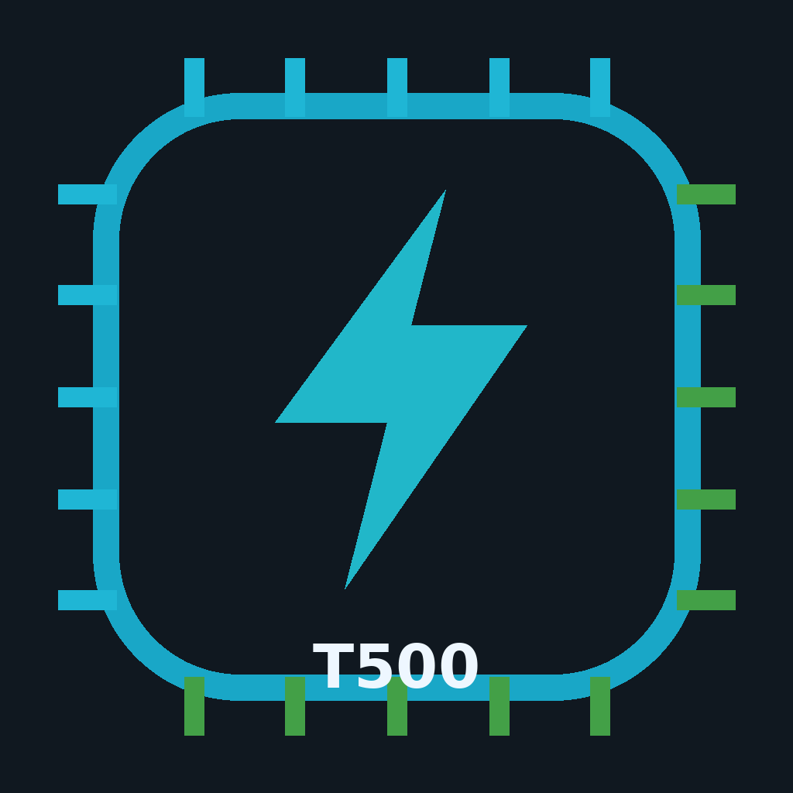

# T500 ESP32 Firmware Flasher

Cross-platform firmware flasher and updater for the AUBOT T500 main controller.

## Current stable release

- GUI: **v1.5.0**
- ESP32 Classic firmware: **v1.0.0**
- ESP32-S3 firmware: **v1.0.0**
- Windows GUI SHA256: `1c70700d4c7e3eb2a25b5d19fcc596049193623cb0f8e174d4210cfd79962349`
- Linux GUI SHA256: `aca9a591b79038e2717413ec4865f34e05bdc937d4d0851fed07550a1c9ab43e`

Validated release paths:
- GUI update `v1.4.3 -> v1.5.0`: PASS
- Firmware sync/update simulation `v0.9.0 -> v1.0.0`: PASS for ESP32 and ESP32-S3
- Packaged executable self-test: PASS
- Release validation: PASS

## Supported targets

| Target | Firmware channel | Flash layout |
|---|---|---|
| ESP32 Classic | Production golden firmware | 0x1000 bootloader, 0x8000 partition, 0x10000 app |
| ESP32-S3 | Legacy-compatible T500 firmware | 0x0000 bootloader, 0x8000 partition, 0x10000 app |

Classic ESP32 firmware remains the immutable production baseline. ESP32-S3 firmware preserves observable compatibility with the classic T500 behavior.

## Operator workflow

1. Download the latest GUI for Windows or Ubuntu.
2. Connect the T500 controller over USB/serial.
3. Open T500 Firmware Flasher.
4. Scan serial ports and detect the chip.
5. Confirm chip, MAC and selected firmware.
6. Press **BẮT ĐẦU FLASH**.
7. Confirm the flash operation.
8. Accept the operation only when **FLASH PASS** is reported.

No ESP-IDF, Python or standalone esptool installation is required on the operator PC.

## Independent updates

- gui-vX.Y.Z: application releases.
- fw-classic-vX.Y.Z: flash-ready ESP32 Classic artifacts.
- fw-s3-vX.Y.Z: flash-ready ESP32-S3 artifacts.
- manifest.json: stable update channel consumed by the GUI.

Firmware can be upgraded without rebuilding the GUI. A firmware release contains only bootloader.bin, partition-table.bin and the application .bin required for flashing.

## Safety controls

- Detect the Espressif chip through the ROM bootloader before flashing.
- Fixed firmware mapping by chip family.
- No manual cross-flash override.
- SHA-256 validation for downloaded firmware.
- No full-chip erase by default.
- Flash verification must succeed before PASS is shown.

## Repository layout

- .github/workflows/ - cross-platform GUI release builds
- assets/ - application branding
- bundled_firmware/ - validated offline baseline binaries
- scripts/ - release helpers
- src/t500_flasher/ - GUI, updater and flasher source
- manifest.json - stable release manifest

## License

MIT License.
